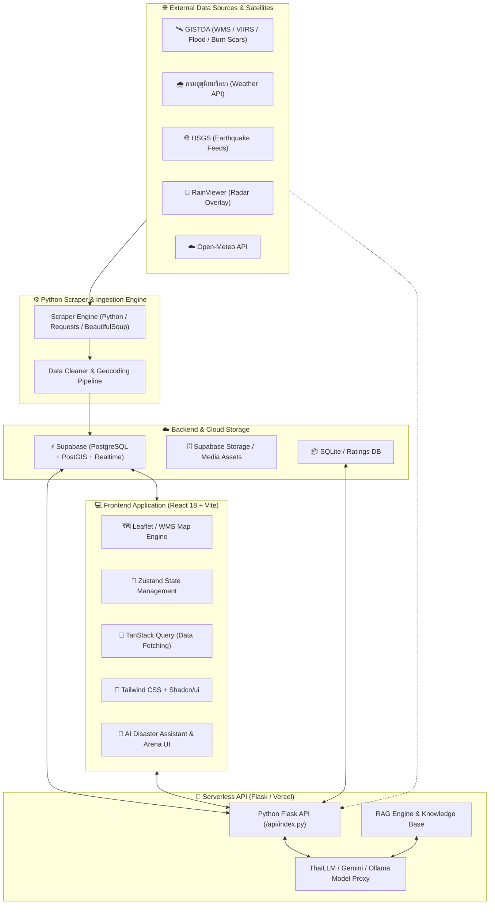

<div align="center">


# 🌊 D-MIND
### Disaster Management & Intelligence Network Dashboard
**แพลตฟอร์มจัดการและเฝ้าระวังภัยพิบัติอัจฉริยะแบบบูรณาการสำหรับประเทศไทย**

[](https://vitejs.dev/)
[](https://reactjs.org/)
[](https://www.typescriptlang.org/)
[](https://tailwindcss.com/)
[](https://leafletjs.com/)
[](https://python.org/)
[](https://supabase.com/)
[](https://thaillm.org)

<p align="center">
  <a href="#-features">คุณสมบัติเด่น</a> •
  <a href="#-system-architecture">สถาปัตยกรรมระบบ</a> •
  <a href="#-tech-stack">เทคโนโลยีที่ใช้</a> •
  <a href="#-getting-started">การติดตั้งและเริ่มใช้งาน</a> •
  <a href="#-data-sources">แหล่งข้อมูล</a> •
  <a href="#-api-reference">API & AI Models</a>
</p>

</div>

---

## 📖 บทนำ (Overview)

**D-MIND** (Disaster Management & Intelligence Network Dashboard) เป็นระบบเว็บแอปพลิเคชันและแดชบอร์ดอัจฉริยะที่ออกแบบมาเพื่อยกระดับการจัดการและเตือนภัยพิบัติในประเทศไทยแบบองค์รวม โดยผสานรวม:
1. **ข้อมูลโทรสัมผัสและดาวเทียมแบบ Real-time (Remote Sensing & GIS)** จาก GISTDA, TMD และ USGS
2. **ปัญญาประดิษฐ์ภาษาไทย (Thai Large Language Models) & RAG System** เพื่อการสืบค้นและตอบคำถามเกี่ยวกับภัยพิบัติ
3. **ระบบประเมินความเสียหาย (AI Damage Assessment)**
4. **ระบบแจ้งเตือนและศูนย์รวมข่าวสารภัยพิบัติทั่วประเทศ**
5. **ระบบรับแจ้งเหตุและขอความช่วยเหลือจากประชาชน (Crowdsourced Citizen Reports)**

---

## ✨ Features (คุณสมบัติเด่น)

### 🗺️ 1. Interactive Disaster Map & Remote Sensing (แผนที่ภัยพิบัติแบบไดนามิก)
- **GISTDA Satellite Layers**: แสดงแผนที่น้ำท่วม (Flood Inundation), จุดความร้อนไฟป่า (VIIRS Hotspots), และรอยไหม้ (Burn Scar Area)
- **Drought & Climate Index**: ชั้นข้อมูลภัยแล้งและสภาพอากาศเชิงพื้นที่
- **Real-time Weather Radar**: ซ้อนทับเรดาร์ฝนแบบสดจาก RainViewer และ Open-Meteo
- **USGS Earthquake Integration**: หมุดจุดศูนย์กลางแผ่นดินไหวขนาดและระดับความลึกแบบ Real-time
- **Filtering & Time Travel**: กรองข้อมูลตามช่วงเวลา รายจังหวัด และระดับความรุนแรง

### 🤖 2. Thai Disaster AI Assistant & LLM Arena (ผู้ช่วย AI และระบบ RAG)
- **Retrieval-Augmented Generation (RAG)**: ตอบคำถามเกี่ยวกับขั้นตอนการรับมือภัยพิบัติ ข้อปฏิบัติตน และข้อมูลสภาพอากาศด้วยชุดข้อมูลอ้างอิงภาษาไทย
- **Multi-Model LLM Arena**: เปรียบเทียบประสิทธิภาพโมเดลภาษาไทยชั้นนำ:
  - `OpenThaiGPT 8B v7.2`
  - `Pathumma 8B Think 3.0.0`
  - `Typhoon-S 8B Instruct`
  - `THaLLE 0.2 8B FA`
  - `Google Gemini Flash`
  - Local LLM via Ollama (`Nemotron-3`, `Gemma 4`)
- **Blind Test & Model Rating**: ให้คะแนนคำตอบ AI เพื่อพัฒนาโมเดล

### 🏚️ 3. AI Damage Assessment (การประเมินความเสียหายด้วย AI)
- วิเคราะห์ภาพถ่ายความเสียหายจากภัยพิบัติ (น้ำท่วม, ดินถล่ม, ไฟไหม้, แผ่นดินไหว)
- คัดกรองและประเมินระดับความเสียหายเบื้องต้นเพื่อจัดลำดับความสำคัญในการช่วยเหลือ

### 📢 4. Disaster News & Real-time Alerts (ศูนย์เตือนภัยและข่าวสาร)
- รวมประกาศเตือนภัยจากกรมอุตุนิยมวิทยาและหน่วยงานภาครัฐ
- สรุปสถานการณ์รายวันพร้อมดัชนีชี้วัดความเสี่ยงภัยประจำพื้นที่
- การแจ้งเตือนภัยผ่าน Web Push Notifications และการกำหนดพิกัดพื้นที่เตือนภัยเฉพาะบุคคล

### 🤝 5. Crowdsourced Incident & Victim Reports (ระบบรายงานเหตุและผู้ประสบภัย)
- ประชาชนสามารถส่งรายงานจุดเกิดเหตุ พร้อมพิกัด GPS ภาพถ่าย และรายละเอียดความช่วยเหลือที่ต้องการ
- แสดงผลหมุดบนแผนที่แบบ Real-time ให้เจ้าหน้าที่และหน่วยกู้ภัยเข้าประสานงานได้ทันท่วงที

### 📚 6. Emergency Manual & Hotline Directory (คู่มือฉุกเฉินและเบอร์โทรด่วน)
- รวมคู่มือเอาชีวิตรอดและวิธีปฏิบัติตนในเหตุฉุกเฉินทุกรูปแบบ
- รวมเบอร์โทรสายด่วนฉุกเฉินทั่วประเทศ สามารถกดโทรออกได้ทันที

### 📊 7. Analytics & Disaster Trends (สถิติและการวิเคราะห์แนวโน้ม)
- แดชบอร์ดแสดงกราฟสถิติภัยพิบัติย้อนหลัง แนวโน้มพื้นที่เสี่ยง และการกระจายตัวของเหตุการณ์

---

## 🏗️ System Architecture (สถาปัตยกรรมระบบ)



---

## 🛠️ Tech Stack (เทคโนโลยีที่ใช้)

| หมวดหมู่ | เทคโนโลยี | รายละเอียดการใช้งาน |
|---|---|---|
| **Frontend Framework** | `React 18.3` + `TypeScript` | โครงสร้างหลักของแอปพลิเคชัน ประสิทธิภาพสูงและ Type-safe |
| **Build & Bundler** | `Vite 7` | พัฒนาและคอมไพล์โค้ดอย่างรวดเร็ว |
| **Styling & Design** | `Tailwind CSS`, `shadcn/ui`, `Framer Motion` | ออกแบบ UI ที่สวยงาม ล้ำสมัย Responsive และมี Micro-interactions |
| **GIS & Mapping** | `Leaflet`, `React-Leaflet`, `GISTDA WMS` | จัดการแผนที่เชิงพื้นที่และเลเยอร์ภาพถ่ายดาวเทียม |
| **State & Data** | `Zustand`, `@tanstack/react-query` | จัดการ Global State และแคชข้อมูล API |
| **Backend & API** | `Python 3.10+`, `Flask`, `Vercel Serverless` | API จัดการระบบ AI Arena, การเชื่อมต่อโมเดล และข้อมูล RAG |
| **Database** | `Supabase (PostgreSQL)`, `SQLite` | จัดเก็บข้อมูลผู้ใช้ รายงานภัยพิบัติ และประวัติการประเมินโมเดล |
| **AI & LLM** | `ThaiLLM`, `Google Gemini`, `Ollama` | โมเดลภาษาปัญญาประดิษฐ์และ RAG ตอบคำถามภัยพิบัติ |
| **Scraper Pipeline** | `Python (BeautifulSoup, Requests, Schedule)` | ดึงข้อมูลภัยพิบัติ สภาพอากาศ และจุดความร้อนแบบอัตโนมัติ |

---

## 📁 Project Structure (โครงสร้างโปรเจกต์)

```
d-mind-web/
├── 📁 api/                  # Python Flask API สำหรับ Serverless Backend
│   ├── index.py            # จุดเชื่อมต่อ API (AI Hub, RAG, Survey)
│   ├── database.py         # ตัวจัดการฐานข้อมูล SQLite สำหรับประเมินผล AI
│   └── supabase_helper.py  # ระบบเชื่อมต่อ Supabase SDK
├── 📁 scraper/              # ระบบดูดและรวบรวมข้อมูลภัยพิบัติอัตโนมัติ
│   ├── scrapers/           # โมดูล Scraper (สภาพอากาศ, น้ำท่วม, ไฟป่า, แผ่นดินไหว)
│   ├── schema.sql          # โครงสร้างฐานข้อมูล PostgreSQL / Supabase
│   └── app.py              # ตัวควบคุมการทำงานตามตารางเวลา
├── 📁 src/                  # ซอร์สโค้ด React Frontend
│   ├── 📁 components/      # คอมโพเนนต์ UI
│   │   ├── disaster-map/   # เลเยอร์แผนที่ WMS, ตัวกรอง, Heatmaps, สถิติ
│   │   ├── chat/           # หน้าต่างแชทกับ AI Assistant
│   │   ├── home/           # คอมโพเนนต์หน้าหลักและ Carousel ข่าว
│   │   ├── ui/             # shadcn/ui components (Radix UI)
│   │   └── ...
│   ├── 📁 contexts/        # React Contexts (ThemeProvider, LanguageProvider)
│   ├── 📁 hooks/           # Custom React Hooks สำหรับดึงข้อมูลและจัดการ State
│   ├── 📁 pages/           # หน้าหลักทั้งหมดของเว็บแอปพลิเคชัน
│   ├── 📁 services/        # Service modules (GISTDA API, Weather API)
│   └── 📁 types/           # Type definitions (TypeScript Interfaces)
├── 📁 public/               # ไฟล์ Assets, Icons, และภาพประกอบ
├── 📄 .env.example          # แม่แบบ Environment Variables
├── 📄 package.json          # รายการ Dependencies และ Scripts ของ Node.js
├── 📄 requirements.txt      # รายการ Dependencies ของ Python Backend
├── 📄 vercel.json           # การตั้งค่า Deployment บน Vercel
└── 📄 README.md             # เอกสารคู่มือโครงการ
```

---

## 🚀 Getting Started (การติดตั้งและเริ่มใช้งาน)

### ข้อกำหนดเบื้องต้น (Prerequisites)
- **Node.js**: เวอร์ชัน `18.0.0` หรือสูงกว่า
- **npm** หรือ **bun**
- **Python**: เวอร์ชัน `3.10` หรือสูงกว่า (สำหรับรัน API / Scraper)
- **Git**

---

### 1. โคลนคลังโค้ด (Clone Repository)
```bash
git clone https://github.com/kchayta32/d-mind-web.git
cd d-mind-web
```

---

### 2. ตั้งค่า Environment Variables
คัดลอกไฟล์ `.env.example` ไปเป็น `.env`:
```bash
cp .env.example .env
```

แก้ไขค่าในไฟล์ `.env` ให้ตรงกับระบบของคุณ:
```env
# Supabase Frontend Keys
VITE_SUPABASE_PROJECT_ID="your_supabase_project_id"
VITE_SUPABASE_PUBLISHABLE_KEY="your_supabase_anon_key"
VITE_SUPABASE_URL="https://your_project.supabase.co"

# AI Model Provider Keys
THAILLM_API_KEY="your_thaillm_api_key"
OPENROUTER_API_KEY="your_openrouter_api_key"
GOOGLE_API_KEY="your_google_gemini_api_key"
OLLAMA_API_KEY=""

# Backend Supabase Config
SUPABASE_URL="https://your_project.supabase.co"
SUPABASE_ANON_KEY="your_supabase_anon_key"
SUPABASE_SERVICE_ROLE_KEY="your_supabase_service_role_key"
```

---

### 3. ติดตั้งและเริ่มรัน Frontend
```bash
# ติดตั้ง dependencies
npm install

# รันโหมด Development Server
npm run dev
```
เปิดเบราว์เซอร์ไปที่: `http://localhost:5173`

---

### 4. (ทางเลือก) ติดตั้งและรัน Python API Server
```bash
# สร้าง virtual environment
python -m venv venv
# สำหรับ Windows:
venv\Scripts\activate
# สำหรับ macOS/Linux:
source venv/bin/activate

# ติดตั้ง requirements
pip install -r requirements.txt

# รัน Flask API
python api/index.py
```

---

## 🌐 Data Sources & Integrations (แหล่งข้อมูลอ้างอิง)

| องค์กร / แหล่งข้อมูล | ประเภทข้อมูล | การใช้งานในระบบ | เว็บไซต์ทางการ |
|---|---|---|---|
| **GISTDA** (สทอภ.) | ดาวเทียม / GIS / WMS | แผนที่น้ำท่วม, จุดความร้อน VIIRS, รอยไหม้ | [gistda.or.th](https://www.gistda.or.th) |
| **กรมอุตุนิยมวิทยา (TMD)** | พยากรณ์อากาศและเตือนภัย | ข้อมูลสภาพอากาศ สภาพฝนตก ประกาศเตือนภัย | [tmd.go.th](https://www.tmd.go.th) |
| **USGS** | ธรณีวิทยาและแผ่นดินไหว | ข้อมูลแผ่นดินไหว Real-time ทั่วโลกและแถบอาเซียน | [earthquake.usgs.gov](https://earthquake.usgs.gov) |
| **Open-Meteo** | Weather Models | ข้อมูลอุณหภูมิ ความชื้น ลม ย้อนหลังและพยากรณ์ | [open-meteo.com](https://open-meteo.com) |
| **RainViewer** | Live Radar Tiles | แผนที่ภาพถ่ายเรดาร์ตรวจวัดกลุ่มฝนสด | [rainviewer.com](https://www.rainviewer.com) |
| **OpenStreetMap** | Base Maps & Carto | แผนที่พื้นฐานและโครงข่ายภูมิศาสตร์ | [openstreetmap.org](https://www.openstreetmap.org) |

---

## 🔒 Security & Privacy (ความปลอดภัยและการคุ้มครองข้อมูล)
- ข้อมูลตำแหน่งพิกัด GPS ของผู้ใช้งานได้รับการประมวลผลบนเบราว์เซอร์และใช้เฉพาะเมื่อได้รับอนุญาต (Explicit User Consent)
- การสื่อสารข้อมูลทั้งหมดผ่าน HTTPS / TLS Encryption
- ระบบเก็บข้อมูลรายงานเหตุและการสำรวจความพึงพอใจเป็นไปตามมาตรฐานการรักษาความปลอดภัย

---

## 👥 Contributors & Acknowledgements

- **Developer**: [kchayta32](https://github.com/kchayta32)
- ขอขอบคุณข้อมูลเปิดและบริการ API จาก **GISTDA**, **กรมอุตุนิยมวิทยา**, **Open-Meteo**, **USGS** และ **ThaiLLM Foundation**

---

<div align="center">

**D-MIND: Disaster Management & Intelligence Network Dashboard**  
Made with ❤️ for Thailand Disaster Management & Community Safety

</div>
