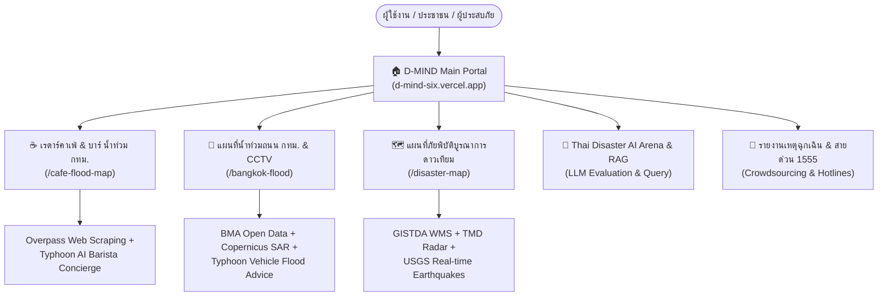
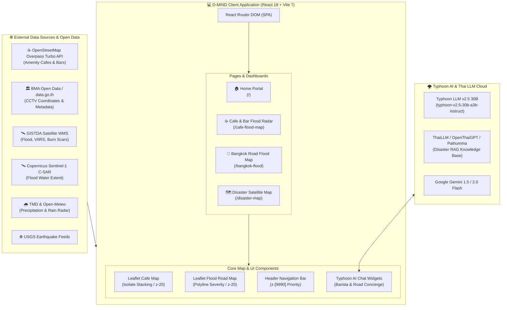

<div align="center">


# 🌊 D-MIND
### Disaster Management & Intelligence Network Dashboard
**แพลตฟอร์มบูรณาการข้อมูลและระบบเตือนภัยพิบัติอัจฉริยะสำหรับประเทศไทย ผสานพลังปัญญาประดิษฐ์และโทรสัมผัส**

[](https://d-mind-six.vercel.app/)
[](https://vitejs.dev/)
[](https://reactjs.org/)
[](https://www.typescriptlang.org/)
[](https://tailwindcss.com/)
[](https://leafletjs.com/)
[](https://opentyphoon.ai)
[](LICENSE)

<br/>

### 🌐 บริการหลักและช่องทางเข้าใช้งานระบบจริง (Live Deployments)

| บริการ / หน้าแอปพลิเคชัน | URL เชื่อมต่อไปยังระบบจริง | รายละเอียดฟังก์ชันหลัก |
|---|---|---|
| 🏠 **หน้าหลัก D-MIND Portal** | **[d-mind-six.vercel.app](https://d-mind-six.vercel.app/)** | ศูนย์กลางบริหารจัดการและเตือนภัยพิบัติ, ดัชนีความเสี่ยงรายวัน, ข่าวสารฉุกเฉิน, Thai LLM Arena, RAG Assistant |
| ☕ **เรดาร์คาเฟ่ & บาร์ น้ำท่วม กทม.** | **[d-mind-six.vercel.app/cafe-flood-map](https://d-mind-six.vercel.app/cafe-flood-map)** | เรดาร์ค้นหาร้านกาแฟ มัทฉะ บาร์ และที่นั่งทำงานที่เปิดให้บริการ ปลอดภัยจากน้ำท่วมขัง พร้อม Typhoon AI Barista Concierge |
| 🚦 **แผนที่น้ำท่วมถนน กทม. & จุดตรวจวัด** | **[d-mind-six.vercel.app/bangkok-flood](https://d-mind-six.vercel.app/bangkok-flood)** | แผนที่ติดตามเส้นทางถนนน้ำท่วม กทม. 3 ระดับสี, สถานีสูบน้ำระบายสู่เจ้าพระยา, ข้อมูลจุดกล้อง CCTV และดาวเทียม Sentinel-1 SAR |
| 🗺️ **แผนที่ภัยพิบัติบูรณาการ (Disaster Map)** | **[d-mind-six.vercel.app/disaster-map](https://d-mind-six.vercel.app/disaster-map)** | แผนที่ดาวเทียม WMS GISTDA ทั่วประเทศ (น้ำท่วม, จุดความร้อน VIIRS, เรดาร์ฝน RainViewer, แผ่นดินไหว USGS) |
| 🌋 **SeismoGuard AI (แผ่นดินไหว)** | **[d-mind-ai-earthquake-guard.vercel.app](https://d-mind-ai-earthquake-guard.vercel.app)** | ระบบนวัตกรรมประเมินและแจ้งเตือนคลื่นแผ่นดินไหวแบบ Real-time ด้วย AI (โครงการประกวด วช. NRCT) |

<br/>

<p align="center">
  <a href="#-1-หน้าหลัก-d-mind-portal">1. หน้าหลัก D-MIND</a> •
  <a href="#-2-เรดาร์คาเฟ่--บาร์-น้ำท่วม-กทม-bangkok-cafe--bar-flood-radar">2. เรดาร์คาเฟ่ & บาร์</a> •
  <a href="#-3-แผนที่น้ำท่วมถนน-กทม--โครงข่ายจุดตรวจวัด-cctv">3. แผนที่น้ำท่วมถนน กทม.</a> •
  <a href="#-system-architecture">สถาปัตยกรรมระบบ</a> •
  <a href="#-tech-stack">เทคโนโลยีที่ใช้</a> •
  <a href="#-getting-started">การติดตั้งและใช้งาน</a>
</p>

</div>

---

## 📖 บทนำ (Overview)

**D-MIND** (*Disaster Management & Intelligence Network Dashboard*) ได้รับการพัฒนาขึ้นเพื่อเป็นโครงสร้างพื้นฐานดิจิทัลด้านการเตือนภัยและรับมือภัยพิบัติสำหรับประชาชนและหน่วยงานในประเทศไทย โดยเชื่อมต่อข้อมูลสารสนเทศภูมิศาสตร์ (GIS), ภาพถ่ายดาวเทียมโทรสัมผัส (Remote Sensing), ข้อมูลโทรมาตรตรวจวัดระดับน้ำและสภาพอากาศแบบเรียลไทม์ และผสานพลังปัญญาประดิษฐ์โมเดลภาษาไทย **Typhoon LLM v2.5** เพื่อให้คำแนะนำที่แม่นยำ ปฏิบัติได้จริง และเข้าถึงได้ง่ายในยามเกิดวิกฤตสภาพอากาศ

---

## 🌟 จุดเด่นและระบบงานหลัก (Core Modules)


```mermaid
graph TD
    User([ผู้ใช้งาน / ประชาชน / ผู้ประสบภัย]) --> Portal["🏠 D-MIND Main Portal\n(d-mind-six.vercel.app)"]
    
    Portal --> Mod1["☕ เรดาร์คาเฟ่ & บาร์ น้ำท่วม กทม.\n(/cafe-flood-map)"]
    Portal --> Mod2["🚦 แผนที่น้ำท่วมถนน กทม. & CCTV\n(/bangkok-flood)"]
    Portal --> Mod3["🗺️ แผนที่ภัยพิบัติบูรณาการดาวเทียม\n(/disaster-map)"]
    Portal --> Mod4["🤖 Thai Disaster AI Arena & RAG\n(LLM Evaluation & Query)"]
    Portal --> Mod5["📢 รายงานเหตุฉุกเฉิน & สายด่วน 1555\n(Crowdsourcing & Hotlines)"]

    Mod1 --> Engine1["Overpass Web Scraping +\nTyphoon AI Barista Concierge"]
    Mod2 --> Engine2["BMA Open Data + Copernicus SAR +\nTyphoon Vehicle Flood Advice"]
    Mod3 --> Engine3["GISTDA WMS + TMD Radar +\nUSGS Real-time Earthquakes"]
```

---

### 🏠 1. หน้าหลัก: D-MIND Portal
> **URL:** [https://d-mind-six.vercel.app/](https://d-mind-six.vercel.app/)

ศูนย์กลางข่าวสารและแดชบอร์ดติดตามภัยพิบัติระดับประเทศ ออกแบบตามมาตรฐาน **UI/UX Pro Max** รองรับโหมดมืด (Dark Mode) และโหมดสว่าง (Light Mode) อย่างสมบูรณ์:

1. **Live Emergency Announcement & Hero Banner:**
   - แสดงสถานะเฝ้าระวังมรสุมและฝนตกหนักแบบไดนามิก
   - แบนเนอร์ทางลัดด่วนสู่นวัตกรรมล่าสุด **"เรดาร์คาเฟ่ & บาร์ น้ำท่วม กทม."** และ **"แผนที่น้ำท่วมถนน กทม."**
2. **ดัชนีชี้วัดสถานการณ์ฉุกเฉินรายวัน (Daily Disaster Indicators):**
   - ตรวจจับระดับความเสี่ยงประจำวัน สภาพฝนสะสม พื้นที่เสี่ยงน้ำหลาก และจุดความร้อนไฟป่า
3. **Thai Disaster AI Assistant & LLM Arena:**
   - ระบบสืบค้นข้อมูลภัยพิบัติด้วยเทคนิค **Retrieval-Augmented Generation (RAG)**
   - เวทีทดสอบและเปรียบเทียบประสิทธิภาพโมเดลภาษาไทยชั้นนำ:
     - `Typhoon-S 8B Instruct / v2.5 30B`
     - `OpenThaiGPT 8B v7.2`
     - `Pathumma 8B Think 3.0.0`
     - `THaLLE 0.2 8B FA`
     - `Google Gemini 1.5 / 2.0 Flash`
     - Local LLM via Ollama (`Nemotron-3`, `Gemma`)
4. **AI Damage Assessment (ระบบประเมินความเสียหายจากภาพถ่าย):**
   - วิเคราะห์ภาพถ่ายความเสียหายจากภัยพิบัติด้วยโมเดล Vision AI เพื่อคัดกรองระดับความเร่งด่วนในการช่วยเหลือ
5. **ศูนย์รับแจ้งเหตุประชาชน & รวบรวมสายด่วนฉุกเฉิน (Hotline Directory):**
   - รวมเบอร์โทรฉุกเฉินสำคัญ เช่น สายด่วน กทม. **1555**, กู้ชีพ **1669**, ดับเพลิง **199**, ตำรวจทางหลวง **1193** พร้อมฟังก์ชันคลิกโทรออกได้ทันที

---

### ☕ 2. เรดาร์คาเฟ่ & บาร์ น้ำท่วม กทม. (Bangkok Cafe & Bar Flood Radar)
> **URL:** [https://d-mind-six.vercel.app/cafe-flood-map](https://d-mind-six.vercel.app/cafe-flood-map)

โซลูชันนวัตกรรมที่ออกแบบมาเพื่อช่วยเหลือคนกรุงเทพฯ ในช่วงสัปดาห์มรสุมและฝนตกหนัก ค้นหาร้าน Specialty Coffee, ร้านมัทฉะ, ค็อกเทลบาร์, เบเกอรี่ และพื้นที่นั่งทำงาน (Coworking Space) ที่ **เปิดให้บริการจริง** และ **ปลอดภัยจากน้ำท่วมขัง**:

```
┌────────────────────────────────────────────────────────────────────────┐
│ ☕ Bangkok Cafe & Bar Flood Radar                                      │
├──────────────────────────────────┬─────────────────────────────────────┤
│ 🗺️ Interactive React-Leaflet Map  │ 🔍 Search & Multi-Filters Bar       │
│  - 60+ Curated Beloved Venues    │  - Categories: Coffee, Matcha, Bar, │
│  - Category Icon & Glow Halos    │    Bakery, Coworking, Pet-Friendly  │
│  - Flood Safe Halo (Green/Amber) │  - Zones: Inner, Outer, Thonburi,   │
│  - Flooded Roads Polyline Layer  │    Metropolitan Perimeter           │
│  - Bottom-right Zoom Control     │  - Day/Time: Live Open, Morning,    │
│  - Stacking Context Isolated     │    Afternoon, Evening, Custom Hour  │
│                                  │  - Toggle: Flood Safe Only / OSM    │
├──────────────────────────────────┴─────────────────────────────────────┤
│ 🌪️ Typhoon LLM AI Barista & Flood Weather Concierge (v2.5-30b)         │
│  - "วิเคราะห์ระดับน้ำขังรอบร้าน แนะนำเมนู และเส้นทางหลบฝนแบบเรียลไทม์"    │
└────────────────────────────────────────────────────────────────────────┘
```

#### คุณสมบัติเด่นของเรดาร์คาเฟ่ & บาร์:
- **ครอบคลุม 4 โซนหลักทั่วกรุงเทพฯ และปริมณฑล:**
  - **กทม. ชั้นใน (Inner Bangkok):** สยาม, สุขุมวิท, สาทร, อารีย์, พระนคร, ตลาดน้อย, เจริญกรุง
  - **กทม. ชั้นนอก (Outer Bangkok):** บางนา, อุดมสุข, ลาดกระบัง, จตุจักร, รามอินทรา, บางกะปิ
  - **ฝั่งธนบุรี (Thonburi):** คลองสาน, เจริญนคร, ตลาดพลู, ราชพฤกษ์, ปิ่นเกล้า, ธนบุรี
  - **ปริมณฑล (Metropolitan Area):** นนทบุรี, ปทุมธานี, สมุทรปราการ, นครปฐม
- **ระบบกรองวันและเวลาเปิด-ปิดร้าน (Day & Time Filter Engine):**
  - ตรวจสอบสถานะการเปิดบริการจริงตามวัน (วันนี้, พรุ่งนี้, จันทร์-อาทิตย์) และช่วงเวลา (เปิดตอนนี้เลย, เช้า, บ่าย, เย็น, ดึก)
- **Web Scraping & Open Data สด:**
  - ดึงข้อมูลพิกัดและรายละเอียดร้านสดผ่าน **OpenStreetMap Overpass Turbo API** พร้อมระบบแคชข้อมูล LocalStorage 30 นาที
- **เลเยอร์ซ้อนทับถนนน้ำท่วม กทม. (BMA Flooded Roads Layer):**
  - แสดงเส้นทางน้ำท่วมระดับวิกฤตและเฝ้าระวังบนแผนที่คาเฟ่ เพื่อให้ผู้ใช้งานมองเห็นทันทีว่าเส้นทางไปร้านมีน้ำขังหรือไม่
- **ผู้ช่วยปัญญาประดิษฐ์ Typhoon AI Barista (`typhoon-v2.5-30b-a3b-instruct`):**
  - แชตบอตบาริสต้าอัจฉริยะที่เชี่ยวชาญทั้งกาแฟ มัทฉะ บาร์ และสภาพการจราจรหน้าฝน พร้อมปุ่ม Prompt ทางลัด 1 คลิก

---

### 🚦 3. แผนที่น้ำท่วมถนน กทม. & โครงข่ายจุดตรวจวัด (Bangkok Road Flood & Monitoring Network)
> **URL:** [https://d-mind-six.vercel.app/bangkok-flood](https://d-mind-six.vercel.app/bangkok-flood)

ระบบติดตามระดับน้ำท่วมขังบนผิวการจราจรถนนสายหลักทั่วกรุงเทพมหานครแบบบูรณาการ ช่วยให้ประชาชนวางแผนการเดินทาง หลีกเลี่ยงจุดเสี่ยง และถนอมยานพาหนะ:

```
┌────────────────────────────────────────────────────────────────────────┐
│ 🚦 Bangkok Road Flood & Drainage Monitoring Network                     │
├────────────────────────────────────────────────────────────────────────┤
│ 🛣️ 39+ สายทางหลัก กทม. แบ่ง 3 ระดับสีตามมาตรฐานความรุนแรง:                 │
│   🔴 สีแดง (วิกฤต): น้ำท่วมสูงเกิน 20-30 ซม. เลนขวาท่วม รถเล็กห้ามผ่าน    │
│   🟠 สีส้ม (เฝ้าระวัง): น้ำขัง 10-20 ซม. ท่วมเลนซ้าย ชะลอความเร็ว          │
│   🟢 สีเขียว (ปกติ): ผิวการจราจรแห้ง สัญจรได้ตามปกติทุกช่องทาง           │
├────────────────────────────────────────────────────────────────────────┤
│ 🌊 โทรมาตรสถานีระบายน้ำและระดับน้ำคลองสายหลักสู่แม่น้ำเจ้าพระยา          │
│ 🛰️ เลเยอร์ดาวเทียม Copernicus Sentinel-1 C-SAR ตรวจจับผิวน้ำท่วมขังทะลุเมฆ │
├────────────────────────────────────────────────────────────────────────┤
│ 📷 เครือข่ายจุดกล้อง CCTV สำนักการจราจรและขนส่ง (สจส.) กทม. 300+ จุด:   │
│   - สถานะ: [กำลังปรับปรุงแก้ไข / Maintenance Mode]                      │
│   - แสดงข้อมูลจุดติดตั้ง, ทิศทางมุมกล้อง, หน่วยงานดูแล, พิกัด GPS          │
│   - เชื่อมต่อพอร์ทัลทางการ BMA Traffic (bmatraffic.com) & ศูนย์ระบายน้ำ DDS│
├────────────────────────────────────────────────────────────────────────┤
│ 🌪️ Typhoon LLM AI Flood Concierge:                                     │
│   - วิเคราะห์ความปลอดภัยแยกตามประเภทยานพาหนะ (Eco Car, Sedan, SUV,      │
│     กระบะยกสูง, มอเตอร์ไซค์) พร้อมคำแนะนำเส้นทางเลี่ยงน้ำท่วมแบบเรียลไทม์ │
└────────────────────────────────────────────────────────────────────────┘
```

#### การแก้ปัญหาด้านเทคนิค (Technical Fixes & Architecture Highlights):
1. **การปรับระบบกล้อง CCTV สู่โหมดซ่อมบำรุง (Maintenance Mode):**
   - ถอดการฝัง YouTube Live Stream ออกทั้งหมดเพื่อความปลอดภัยและความเสถียร
   - แสดงหน้าจอโหมดซ่อมบำรุงแบบไฮเทคพร้อมข้อมูลพิกัดจุดติดตั้ง และลิงก์ตรงไปยังพอร์ทัลทางการของกรุงเทพมหานคร
   - ตั้งค่าเริ่มต้นของเลเยอร์กล้องให้ปิด (`showCctvLayer: false`) เพื่อไม่ให้หมุด 300+ จุดบดบังแผนที่เส้นทางถนน
2. **การแก้ไขข้อผิดพลาดการซ้อนทับของแผนที่ (Map Overlapping & Stacking Context Isolation):**
   - เพิ่ม `isolation: isolate` ในกรอบแผนที่ ป้องกันไม่ให้คอนโทรลและหมุดมาร์กเกอร์หลุดออกมารบกวนองค์ประกอบภายนอก
   - ปรับ `Navbar.tsx` เป็น `z-[9990]` เพื่อให้อยู่เหนือเลเยอร์แผนที่เสมอขณะเลื่อนหน้าจอ (Scroll)
   - ปิดปุ่มซูมมุมซ้ายบนเดิม (`zoomControl={false}`) และย้ายปุ่มซูมไปไว้ที่ **มุมขวาล่าง** (`<ZoomControl position="bottomright" />`) ขจัดปัญหาปุ่มซูมชนทับกับแถบเลือกแผนที่ฐาน

---

## 🏗️ System Architecture (สถาปัตยกรรมระบบ)


```mermaid
flowchart TB
    subgraph DataSources["🌐 External Data Sources & Open Data"]
        OSMOverpass["☕ OpenStreetMap Overpass Turbo API\n(Amenity Cafes & Bars)"]
        BMAData["🏛️ BMA Open Data / data.go.th\n(CCTV Coordinates & Metadata)"]
        GISTDA["🛰️ GISTDA Satellite WMS\n(Flood, VIIRS, Burn Scars)"]
        Sentinel["🛰️ Copernicus Sentinel-1 C-SAR\n(Flood Water Extent)"]
        TMD["🌧️ TMD & Open-Meteo\n(Precipitation & Rain Radar)"]
        USGS["🌐 USGS Earthquake Feeds"]
    end

    subgraph AICloud["🌪️ Typhoon AI & Thai LLM Cloud"]
        Typhoon["Typhoon LLM v2.5 30B\n(typhoon-v2.5-30b-a3b-instruct)"]
        ThaiLLM["ThaiLLM / OpenThaiGPT / Pathumma\n(Disaster RAG Knowledge Base)"]
        GeminiFlash["Google Gemini 1.5 / 2.0 Flash"]
    end

    subgraph FrontendApp["💻 D-MIND Client Application (React 18 + Vite 7)"]
        Router["React Router DOM (SPA)"]
        
        subgraph Pages["Pages & Dashboards"]
            MainPortal["🏠 Home Portal\n(/)"]
            CafeRadar["☕ Cafe & Bar Flood Radar\n(/cafe-flood-map)"]
            BkkFlood["🚦 Bangkok Road Flood Map\n(/bangkok-flood)"]
            DisasterMap["🗺️ Disaster Satellite Map\n(/disaster-map)"]
        end

        subgraph CoreComponents["Core Map & UI Components"]
            CafeMapComponent["Leaflet Cafe Map\n(Isolate Stacking / z-20)"]
            BkkMapComponent["Leaflet Flood Road Map\n(Polyline Severity / z-20)"]
            NavbarComp["Header Navigation Bar\n(z-[9990] Priority)"]
            TyphoonChat["Typhoon AI Chat Widgets\n(Barista & Road Concierge)"]
        end
    end

    DataSources --> FrontendApp
    AICloud <--> TyphoonChat
    Router --> Pages
    Pages --> CoreComponents
```

---

## 🛠️ Tech Stack (เทคโนโลยีที่ใช้)

| หมวดหมู่ | เทคโนโลยี | รายละเอียดการใช้งาน |
|---|---|---|
| **Frontend Framework** | `React 18.3` + `TypeScript 5.5` | โครงสร้างสถาปัตยกรรมเว็บแอปพลิเคชันหลัก รองรับ Single Page Application (SPA) |
| **Bundler & Build Tool** | `Vite 7.3+` | เครื่องมือคอมไพล์และ Bundle โค้ดประสิทธิภาพสูง ใช้เวลาสร้าง Production ต่ำกว่า 40 วินาที |
| **Styling & Design System** | `Tailwind CSS 3.4`, `shadcn/ui`, `Lucide Icons` | ดีไซน์อินเทอร์เฟซทันสมัยระดับ UI/UX Pro Max พร้อมระบบชุดสี Dark/Light Mode และ CSS Stacking Context Isolation |
| **Mapping & GIS** | `Leaflet 1.9`, `React-Leaflet 4.2`, `Jawg Maps`, `Esri` | แสดงผลแผนที่เชิงพื้นที่, Polylines ความเสี่ยงน้ำท่วม, หมุดคัสตอมพร้อม Glowing Halos และเลเยอร์ดาวเทียม |
| **Generative AI & LLM** | `Typhoon LLM v2.5 30B` (`opentyphoon.ai`), `ThaiLLM`, `Gemini Flash` | โมเดลภาษาปัญญาประดิษฐ์สัญชาติไทย ตอบคำถามสภาพอากาศ แนะนำร้านกาแฟ และวิเคราะห์เส้นทางน้ำท่วม |
| **Web Scraping & Open Data** | `OpenStreetMap Overpass API`, `data.go.th` | ดึงข้อมูลพิกัดร้านคาเฟ่สด และพิกัดจุดติดตั้งกล้องวงจรปิดของกรุงเทพมหานคร |
| **Earth Observation Data** | `Copernicus Sentinel-1 SAR`, `GISTDA WMS`, `Open-Meteo`, `RainViewer` | ข้อมูลดาวเทียมเรดาร์ตรวจจับผิวน้ำท่วมขัง, เรดาร์กลุ่มฝน และจุดศูนย์กลางแผ่นดินไหว |
| **Deployment & Hosting** | `Vercel Serverless Platform` | คลาวด์แพลตฟอร์มสำหรับการประมวลผลและการเผยแพร่ระดับ Production อัปเดตอัตโนมัติผ่าน Git Push |

---

## 📁 โครงสร้างโปรเจกต์ (Project Structure)

```
d-mind-web/
├── 📁 scripts/                      # สคริปต์ทดสอบระบบอัตโนมัติ (Automated Test Suites)
│   ├── run-cafe-flood-tests.mjs     # การทดสอบความถูกต้องของเรดาร์คาเฟ่ (43 ข้อทดสอบ)
│   ├── run-bkk-tests.mjs            # การทดสอบระบบแผนที่น้ำท่วม กทม. (59 ข้อทดสอบ)
│   └── run-typhoon-cctv-tests.mjs   # การทดสอบ Typhoon AI & โหมดปรับปรุง CCTV (33 ข้อทดสอบ)
├── 📁 src/                          # ซอร์สโค้ด React Frontend
│   ├── 📁 components/               # คอมโพเนนต์ UI
│   │   ├── 📁 bangkok-flood/        # แผนที่น้ำท่วม กทม., จุดตรวจวัด, สถิติ, Typhoon AI Concierge
│   │   │   ├── BangkokFloodMap.tsx
│   │   │   ├── BangkokFloodControls.tsx
│   │   │   ├── BangkokFloodStats.tsx
│   │   │   ├── BangkokCctvModal.tsx
│   │   │   └── BangkokFloodTyphoonConcierge.tsx
│   │   ├── 📁 cafe-flood/           # เรดาร์คาเฟ่ & บาร์ น้ำท่วม กทม.
│   │   │   ├── CafeFloodMap.tsx
│   │   │   ├── CafeCard.tsx
│   │   │   ├── CafeDetailModal.tsx
│   │   │   ├── CafeTyphoonChat.tsx
│   │   │   └── BangkokCafeFloodBanner.tsx
│   │   ├── 📁 disaster-map/         # แผนที่ดาวเทียม WMS ทั่วประเทศ (GISTDA/USGS/RainViewer)
│   │   ├── 📁 layout/               # Navbar (z-[9990] isolated), Footer, PageLayout
│   │   └── 📁 ui/                   # shadcn/ui components (Dialog, Button, Badge, Switch ฯลฯ)
│   ├── 📁 data/                     # ชุดข้อมูลพิกัดจำลองและข้อมูลรับรอง
│   │   ├── bangkokCafesData.ts      # 60+ คาเฟ่ มัทฉะ บาร์ ทั่ว 4 โซน กทม.-ปริมณฑล
│   │   ├── bangkokRoadFloodData.ts  # 39+ เส้นทางถนนสายหลัก กทม., สถานีสูบน้ำ, ดาวเทียม SAR
│   │   └── bangkokCctvData.ts       # 65+ ข้อมูลจุดกล้องตรวจวัด กทม.
│   ├── 📁 pages/                    # หน้าหลักของระบบ
│   │   ├── Index.tsx                # หน้าหลัก D-MIND Portal
│   │   ├── BangkokCafeFloodMapPage.tsx # หน้าเรดาร์คาเฟ่ & บาร์
│   │   ├── BangkokFloodMapPage.tsx  # หน้าแผนที่น้ำท่วมถนน กทม.
│   │   └── DisasterMap.tsx          # หน้าแผนที่ภัยพิบัติบูรณาการ
│   ├── 📁 services/                 # ตัวเชื่อมต่อ API ภายนอก
│   │   ├── typhoonCafeService.ts    # Typhoon LLM Barista Concierge
│   │   ├── typhoonFloodService.ts   # Typhoon LLM Road Flood Concierge
│   │   ├── cafeOverpassService.ts   # OpenStreetMap Overpass Web Scraping
│   │   └── dataGoThService.ts       # BMA Open Data scraper & mapper
│   └── 📁 types/                    # TypeScript Interface Definitions
├── 📄 package.json                  # รายการ Dependencies และ Build Scripts
├── 📄 tsconfig.json                 # TypeScript Configuration
└── 📄 README.md                     # เอกสารคู่มือโครงการ
```

---

## 🚀 การติดตั้งและเริ่มใช้งาน (Getting Started)

### ข้อกำหนดเบื้องต้น (Prerequisites)
- **Node.js**: เวอร์ชัน `18.0.0` หรือสูงกว่า
- **npm** (หรือ **bun**, **pnpm**)
- **Git**

### 1. โคลนคลังโค้ด (Clone Repository)
```bash
git clone https://github.com/kchayta32/d-mind-web.git
cd d-mind-web
```

### 2. ติดตั้ง Dependencies
```bash
npm install
```

### 3. ตั้งค่าตัวแปรสภาพแวดล้อม (.env)
คัดลอกไฟล์ `.env.example` ไปเป็น `.env` และระบุคีย์บริการ:
```bash
cp .env.example .env
```
ตัวอย่างการตั้งค่าคีย์ที่จำเป็น:
```env
# Typhoon LLM API Key (สำหรับระบบ AI Barista & Flood Concierge)
VITE_TYPHOON_API_KEY="sk-your-typhoon-api-key"

# Jawg Maps Token (สำหรับ Base Map โหมดมืดและเมทริกซ์)
VITE_JAWG_ACCESS_TOKEN="your-jawg-access-token"

# Supabase (สำหรับการจัดเก็บข้อมูลรายงานเหตุฉุกเฉิน)
VITE_SUPABASE_URL="https://your-project.supabase.co"
VITE_SUPABASE_PUBLISHABLE_KEY="your-supabase-anon-key"
```

### 4. รันระบบในโหมดพัฒนา (Development Server)
```bash
npm run dev
```
เปิดเบราว์เซอร์ไปที่: `http://localhost:5173`

### 5. รันชุดทดสอบคุณภาพอัตโนมัติ (Run Test Suites)
```bash
# รันการทดสอบเรดาร์คาเฟ่ & บาร์
node scripts/run-cafe-flood-tests.mjs

# รันการทดสอบแผนที่น้ำท่วมถนน กทม.
node scripts/run-bkk-tests.mjs

# รันการทดสอบกล้อง CCTV และ Typhoon AI
node scripts/run-typhoon-cctv-tests.mjs
```

### 6. ตรวจสอบชนิดข้อมูลและสร้างไฟล์สำหรับการเผยแพร่จริง (Production Build)
```bash
# Type-check ด้วย TypeScript
npx tsc --noEmit

# คอมไพล์โปรเจกต์
npm run build
```

---

## 🌐 แหล่งข้อมูลเปิดและการอ้างอิง (Data Sources & Credits)

| องค์กร / ผู้ให้บริการ | ข้อมูลที่ใช้งานในระบบ | เว็บไซต์ทางการ |
|---|---|---|
| **SCB 10X / OpenTyphoon** | `typhoon-v2.5-30b-a3b-instruct` สำหรับ AI Concierge | [opentyphoon.ai](https://opentyphoon.ai) |
| **กรุงเทพมหานคร (BMA)** | ข้อมูลจุดติดตั้งกล้อง สจส. และศูนย์ป้องกันน้ำท่วม สสน. กทม. | [bmatraffic.com](http://www.bmatraffic.com) • [dds.bangkok.go.th](https://dds.bangkok.go.th) |
| **OpenStreetMap & Overpass** | ข้อมูลตำแหน่งคาเฟ่ ร้านมัทฉะ และค็อกเทลบาร์ | [openstreetmap.org](https://www.openstreetmap.org) |
| **Copernicus / ESA** | ภาพถ่ายดาวเทียม Sentinel-1 C-SAR Hydrography | [copernicus.eu](https://www.copernicus.eu) |
| **GISTDA (สทอภ.)** | ข้อมูลแผนที่น้ำท่วมและดาวเทียม WMS ทั่วประเทศ | [gistda.or.th](https://www.gistda.or.th) |
| **Open-Meteo & RainViewer** | เรดาร์ตรวจวัดกลุ่มฝนและโมเดลพยากรณ์ปริมาณน้ำฝน | [open-meteo.com](https://open-meteo.com) • [rainviewer.com](https://www.rainviewer.com) |

---

## 👥 ผู้พัฒนาและการติดต่อ (Authors & Contact)

- **โครงการ D-MIND (Disaster Management & Intelligence Network Dashboard)**
- **GitHub Repository**: [https://github.com/kchayta32/d-mind-web](https://github.com/kchayta32/d-mind-web)
- **Live Production URL**: [https://d-mind-six.vercel.app](https://d-mind-six.vercel.app)

---

<div align="center">

**D-MIND: นวัตกรรมดิจิทัลเพื่อความปลอดภัยและการดำเนินชีวิตของประชาชนไทยในทุกฤดูกาล**  
Made with ❤️ by [kchayta32](https://github.com/kchayta32)

</div>
