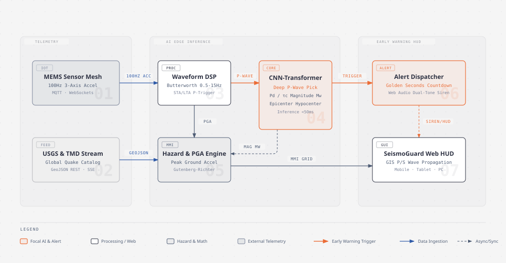

# SeismoGuard AI (ระบบแจ้งเตือนแผ่นดินไหวด้วยปัญญาประดิษฐ์แบบเรียลไทม์)

> **นวัตกรรมระบบปัญญาประดิษฐ์ตรวจจับและแจ้งเตือนภัยแผ่นดินไหวล่วงหน้าแบบเรียลไทม์ (AI-Powered Real-Time Earthquake Early Warning System)**  
> โครงการพัฒนาเพื่อการแข่งขันนวัตกรรมด้านเทคโนโลยี สำนักงานการวิจัยแห่งชาติ (วช. / NRCT)

[](LICENSE)
[](https://reactjs.org/)
[](https://www.typescriptlang.org/)
[](https://tailwindcss.com/)
[](https://leafletjs.com/)

---

## 🏛️ System Architecture Diagram (สถาปัตยกรรมระบบ)

สถาปัตยกรรมระบบของ SeismoGuard AI ออกแบบตามแนวคิด **Edge AI Telemetry & Multi-Tier Early Warning** โดยแบ่งการทำงานออกเป็น 3 เลเยอร์หลักตามมาตรฐาน Editorial Design System:

<div align="center">
  
  <p><em>รูปที่ 1: แผนผังแสดงการทำงานของระบบ SeismoGuard AI จากโครงข่ายเซนเซอร์สู่การประมวลผล Edge AI และการกระจายสัญญาณเตือนภัยฉุกเฉิน</em></p>
  <p>
    <a href="./docs/diagrams/seismoguard-architecture.html">🔍 ดูไฟล์ HTML แบบเต็ม (Interactive)</a> &nbsp;|&nbsp;
    <a href="./docs/diagrams/seismoguard-architecture.svg">📐 ดูไฟล์ Vector SVG</a> &nbsp;|&nbsp;
    <a href="./docs/diagrams/seismoguard-architecture.png">🖼️ ดาวน์โหลดรูปภาพ Retina PNG (2x)</a>
  </p>
</div>

---

## ⚡ เบื้องหลังการเลือก Diagram Type สำหรับ GitHub README

จากการวิเคราะห์และเปรียบเทียบทั้ง **38 Editorial Diagram Types** ในระบบ `diagram-design-skill` รูปแบบที่ได้รับคัดเลือกเป็น **Hero Diagram** ประจำหน้า `README.md` คือ:

### 1. Architecture / High-Level System Topology (ทางเลือกที่ดีที่สุดอันดับ 1) ⭐
- **เหตุผลที่เหมาะสมที่สุด:** หน้ารวมโปรเจกต์บน GitHub เป็นด่านแรกที่คณะกรรมการผู้ทรงคุณวุฒิ วช. และนักพัฒนาภายนอกจะเข้ามาศึกษา การแสดงภาพสถาปัตยกรรมระบบโดยรวม (End-to-End Topology) ช่วยให้ผู้ตรวจประเมินเข้าใจโครงสร้างตั้งแต่ฮาร์ดแวร์ IoT Sensor การประมวลผลสัญญาณคลื่น P-wave ด้วยโมเดลปัญญาประดิษฐ์ ไปจนถึงหน้าจอศูนย์บัญชาการ (HUD) ได้อย่างสมบูรณ์ภายใน 5 วินาที
- **การควบคุมคุณภาพการออกแบบ (Design Standards):**
  - **4px Grid Alignment:** ทุกมิติ พิกัด และขนาดตัวอักษรเป็นพหุคูณของ 4
  - **Editorial Color Hierarchy:** ควบคุมจุดโฟกัส (Coral Focal Accent) ไม่เกิน 2 จุด ได้แก่ **CNN-Transformer Core** (หัวใจ AI) และ **Alert Dispatcher** (ระบบเตือนภัย)
  - **6 Mandatory Connector Rules:** ใช้เส้นเชื่อมต่อมุมฉากโค้งมน ($r=8$px) ทั้งหมด ไม่ใช้เส้นทแยง มีระยะ Mask Rect ห่างจากเส้นสายสัญญาณ $8$px ป้องกันเส้นซ้อนทับกันอย่างเด็ดขาด
  - **Density Control:** จัดวาง 7 โหนดหลัก (ภายใต้งบประมาณ $\le 9$ โหนด) เพื่อความชัดเจนในการอ่านทั้งใน Light Mode และ Dark Mode

### 2. Data Flow / Signal Processing Pipeline (ทางเลือกสนับสนุนสำหรับส่วนระเบียบวิธีวิจัย AI)
- เหมาะสำหรับการอธิบายกระบวนการแปลงคลื่นความเร่ง 3 แกน (Raw 100Hz Accelerogram) ผ่านวงจรกรอง Butterworth 0.5-15Hz $
ightarrow$ อัลกอริทึม STA/LTA Ratio $
ightarrow$ การสกัดพารามิเตอร์ $P_d$ และ $	au_c$ เข้าสู่ Deep Learning เพื่อทำนายขนาดแมกนิจูด ($M_w$) และความเร่งสูงสุดของพื้นดิน (PGA)

### 3. Sequence / Golden Seconds Timeline (ทางเลือกสนับสนุนสำหรับฟิสิกส์คลื่นไหวสะเทือน)
- เหมาะสำหรับการนำเสนอแกนเวลาทางฟิสิกส์ (Timeline) นับตั้งแต่เกิดรอยเลื่อนแตกตัว ($T=0s$) $
ightarrow$ คลื่นปฐมภูมิ (P-wave) เดินทางถึงเซนเซอร์ ($T+3s$) $
ightarrow$ ปัญญาประดิษฐ์ส่งสัญญาณเตือนภัย ($T+4s$) $
ightarrow$ คลื่นทุติยภูมิทำลายล้าง (S-wave) เดินทางถึงเมืองเป้าหมาย ($T+22s$) มอบ "วินาทีทอง (Golden Seconds)" ให้ประชาชนลี้ภัยได้ทัน 18 วินาที

---

## 🌟 จุดเด่นและนวัตกรรมหลัก (Core Innovations)

1. **Edge AI Ultra-Fast Inference (<50ms):**
   - ใช้อัลกอริทึมตรวจจับคลื่น P-wave เบื้องต้นด้วยอัตราส่วน STA/LTA
   - นำเข้าคลื่น 3 วินาทีแรกสู่โครงข่ายประสาทเทียมแบบผสมผสาน **CNN-Transformer** เพื่อคำนวณ $P_d$ (Peak Displacement) และ $	au_c$ (Characteristic Period) สามารถประมาณการขนาดของแผ่นดินไหว ($M_w$) ได้อย่างแม่นยำก่อนคลื่น S-wave มาถึง
2. **Golden Seconds Dynamic Countdown:**
   - คำนวณระยะทางจากจุดศูนย์กลางแผ่นดินไหว (Epicenter) มายังพิกัดผู้ใช้ เพื่อแสดงเลขอัตราการนับถอยหลังวินาทีทองแบบเรียลไทม์
   - ประเมินระดับความรุนแรงตามมาตราเมอร์คัลลีปรับปรุง (Modified Mercalli Intensity: MMI)
3. **Audio Siren Synthesizer (Web Audio API):**
   - สังเคราะห์สัญญาณไซเรนเตือนภัยคู่ความถี่ 880Hz / 440Hz แบบ Zero-latency ผ่านฮาร์ดแวร์เสียงของเบราว์เซอร์ ไม่ต้องรอโหลดไฟล์เสียงจากเซิร์ฟเวอร์
4. **Interactive GIS Fault-Line Overlay:**
   - แผนที่แสดงรอยเลื่อนมีพลังในประเทศไทย 16 กลุ่มรอยเลื่อน (เช่น รอยเลื่อนแม่จัน, แม่ทา, ศรีสวัสดิ์, เจดีย์สามองค์)
   - จำลองรัศมีการแพร่กระจายคลื่น P-Wave (สีฟ้า) และคลื่น S-Wave (สีส้มแดง) ด้วยวงกลมระลอกคลื่นแบบไดนามิก
5. **Cross-Platform Responsive Command HUD:**
   - รองรับการแสดงผลทุกหน้าจออย่างสมบูรณ์แบบ:
     - **Mobile View (หน้าจอมือถือ):** โหมด Evacuation Alert พร้อมปุ่มโทรสายด่วนฉุกเฉิน (1784 ปภ., 1669 กู้ชีพ)
     - **Tablet View (แท็บเล็ตภาคสนาม):** โหมดตรวจวัดสถานีและกราฟเซนเซอร์แบบเรียลไทม์
     - **PC / Monitor (ศูนย์ควบคุม Command Center):** หน้าจอบัญชาการสถานการณ์ฉุกเฉิน แผนผังสถานี และสถิติย้อนหลัง

---

## 🚀 การติดตั้งและเริ่มต้นใช้งาน (Getting Started)

### ความต้องการของระบบ (Prerequisites)
- [Node.js](https://nodejs.org/) เวอร์ชัน 18 ขึ้นไป
- [npm](https://www.npmjs.com/) หรือ [yarn](https://yarnpkg.com/) / [pnpm](https://pnpm.io/)

### ขั้นตอนการรันโปรเจกต์
```bash
# 1. ไปยังโฟลเดอร์โปรเจกต์
cd "d:/2-2568/d-mind/d-mind web/ai-earthquake-guard"

# 2. ติดตั้ง Dependencies
npm install

# 3. เริ่มต้น Local Development Server
npm run dev
```

เปิดเบราว์เซอร์ไปที่ `http://localhost:5173` เพื่อเข้าใช้งานระบบ SeismoGuard AI

### การทดสอบ Build สำหรับ Production
```bash
npm run build
```
ไฟล์พร้อม Deploy จะถูกสร้างไว้ในโฟลเดอร์ `dist/` โดยผ่านการคอมไพล์ TypeScript และ Tailwind CSS อย่างสมบูรณ์

---

## 📁 โครงสร้างโปรเจกต์ (Project Structure)

```text
ai-earthquake-guard/
├── docs/
│   └── diagrams/
│       ├── seismoguard-architecture.html   # Editorial HTML diagram
│       ├── seismoguard-architecture.svg    # Standalone accessible vector SVG
│       └── seismoguard-architecture.png    # High-resolution retina PNG (2x)
├── src/
│   ├── components/                         # UI Components
│   │   ├── EarthquakeMap.tsx               # Leaflet GIS map with fault lines & wave isochrones
│   │   ├── EarlyWarningHUD.tsx             # Golden seconds countdown & alert modal
│   │   ├── LiveSeismograph.tsx             # Real-time 3-axis accelerometer waveform
│   │   ├── AIModelInsights.tsx             # CNN-Transformer prediction metrics & STA/LTA
│   │   ├── DisasterReadiness.tsx           # Safety protocols & emergency hotline contacts
│   │   └── StationMonitor.tsx              # Thai seismic station mesh status
│   ├── services/                           # Business Logic & Telemetry
│   │   ├── earthquakeService.ts            # USGS live feed & realistic simulation engine
│   │   └── sirenService.ts                 # Web Audio API dual-tone siren synthesizer
│   ├── types/
│   │   └── earthquake.ts                   # TypeScript interfaces & data models
│   ├── App.tsx                             # Primary application container & responsive layout
│   └── main.tsx                            # React entrypoint
├── package.json
├── tsconfig.json
├── tailwind.config.js
└── README.md
```

---

## 👥 ผู้พัฒนาและลิขสิทธิ์ (Credits & License)

- **ผู้พัฒนา:** ทีมพัฒนา SeismoGuard AI เพื่อการแข่งขันนวัตกรรมระดับชาติ วช.
- **ระบบไดอะแกรม:** ออกแบบตามมาตรฐาน [Diagram Design Skill](https://github.com/) (Editorial Design System)
- **ลิขสิทธิ์:** [MIT License](LICENSE)
